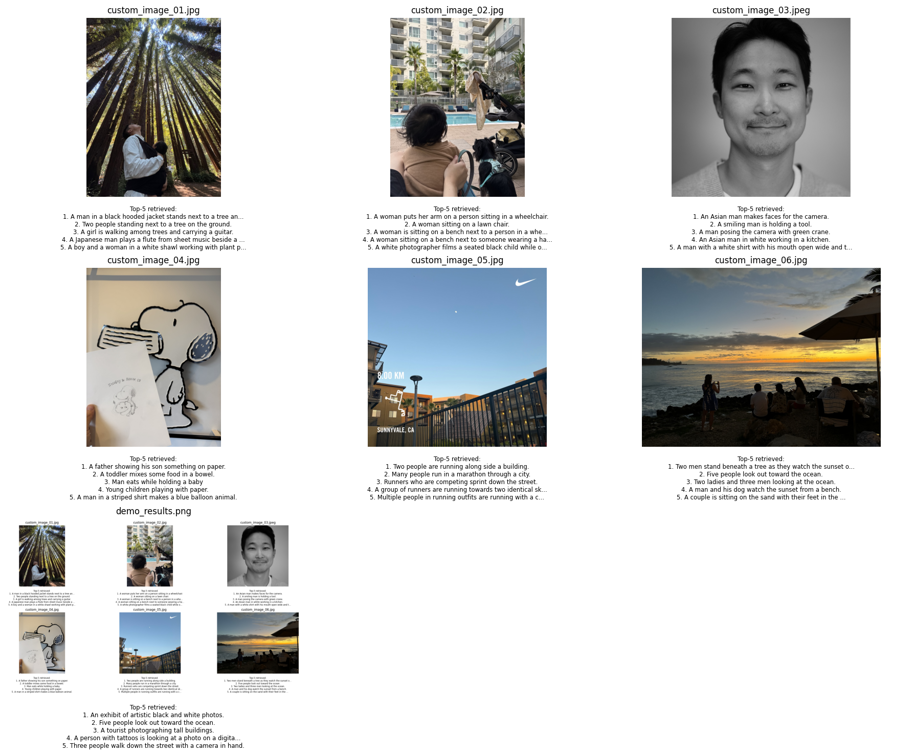

# ml-play

A playground for ML experiments and reference implementations.

## Structure

- **[foundations/](foundations/)** — Model architectures and small pipelines (ViT, Conformer, Perceiver, etc.).
  - **[tiny-clip](foundations/tiny-clip/)** — CLIP-style contrastive learning: modify pretrained CLIP (Track A) or build from components (Track B). Data sanity check, zero-shot eval, and retrieval on Flickr30k.
  - **[tiny-vit](foundations/tiny-vit/)** — ViT: pretrained first, then small from scratch (CIFAR-10). Scaffold.
  - **[tiny_transformer](foundations/tiny_transformer/)** — LLM representation (small transformer reference).
  - **BLIP2** (to be added) — Q-Former bridging frozen image encoder + frozen LLM.
  - **LLaVA** (to be added) — Simple projection + LLM for vision–language.
  - **SwinT, ViViT, Perceiver, Conformer, S4/Mamba** (to be added) — Vision, video, and SSM architectures.
  - **VLA** (to be added) — Vision–language–action for robotics.
- **[timeseries/](timeseries/)** — Time-series tools and notebooks (e.g. HFA envelope methods, ECoG).
- **[docs/](docs/)** — Project plans in [docs/plans/](docs/plans/) (e.g. [tiny-clip](docs/plans/tiny-clip.md)).
- **[notes/](notes/)** — Annotated references and scratch.

## Example: Tiny-CLIP custom images demo

Run pretrained CLIP on your own images — retrieve top-5 captions from the Flickr30k benchmark:

Add images to `foundations/tiny-clip/demos/custom_images/`, run `python demos/demo_custom_images.py`, and the figure is saved to `demos/output/`. See [tiny-clip](foundations/tiny-clip/) for setup and more.

## Example: Dual encoder analysis (B0 vs B1 vs CLIP)

We compose a pretrained ViT + pretrained DistilBERT, add projection heads, and train alignment from scratch. Random projections (B0) give near-random retrieval; training only the projections (B1) on ~29k images yields a ~340× improvement. B1 reaches ~43% of CLIP’s i2t R@1 with projection-only training.

| Model | i2t R@1 | t2i R@1 | Notes |
|-------|---------|---------|-------|
| **CLIP** (pretrained, 400M pairs) | 79.3% | 58.8% | Upper bound |
| **B1** (projections trained, encoders frozen) | 34.3% | 23.9% | ~340× over B0 |
| **B0** (random projections) | 0.1% | 0.08% | Near random |

Flickr30k 1k test set. See [tiny-clip](foundations/tiny-clip/) for details.

## Quick links

- [Tiny-CLIP setup, data sanity check, and sample results](foundations/tiny-clip/)
- [Tiny-ViT scaffold](foundations/tiny-vit/)
- [Project plan (Tiny-CLIP tracks and stages)](docs/plans/tiny-clip.md)
- [Repo roadmap (vision, VLM, distillation, etc.)](docs/plan.md)