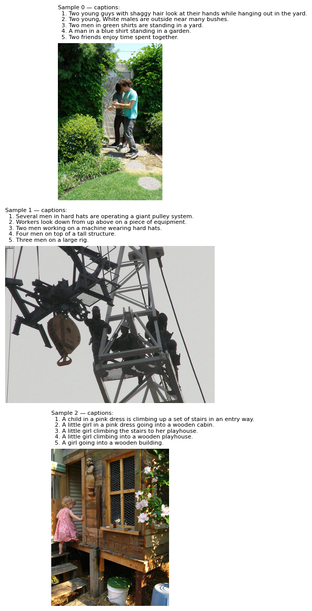

# tiny-clip

CLIP-style contrastive learning pipeline: modify pretrained CLIP (Track A) or build from components (custom dual encoder). See [docs/plan.md](docs/plan.md) for the full plan.

## Sample data

Below is example data from the default config (Flickr30k): each image has 5 ground-truth captions. This is generated by the data sanity check.



## Setup

From this directory:

```bash
pip install -r requirements.txt
```

## Data sanity check

Load the dataset (Flickr30k via Hugging Face, Parquet revision), print batch shapes, and generate the sample image above:

```bash
python -m src.data
```

Output: dataset size, batch tensor shapes, and `Saved visualization to .../sanity_check_samples.png`. Re-run to regenerate the image after config or code changes.

**Split disjointness check (before training):** Verify that train and 1k test are disjoint so you can safely use `train_split: "train"`:

```bash
python -m src.data --check-splits
```

Runs the data sanity check and additionally verifies: train ∩ test = ∅ and 30k test = 1k benchmark. If this passes, you can train on `split="train"` without data leakage.

## Config

- **configs/flickr30k.yaml** — dataset name, split, batch size, revision (Parquet). Retrieval evaluation uses the **standard 1k test set** (`eval_dataset_name: nlphuji/flickr_1k_test_image_text_retrieval`) so numbers are comparable to papers.
- **configs/flickr8k.yaml** — optional smaller dataset.

## Zero-shot retrieval eval

Run retrieval evaluation on the **standard 1k test set** (comparable to papers):

```bash
# CLIP (default)
python -m src.eval_retrieval --config configs/flickr30k.yaml

# Custom dual encoder (ViT + DistilBERT, random projections)
python -m src.eval_retrieval --config configs/custom_dual_encoder.yaml --model-type dual_encoder
```

Optional: save metrics to JSON with `--output metrics.json`.

**Baseline (zero-shot CLIP ViT-B/32, Flickr30k 1k test):**

| Metric | i2t | t2i |
|--------|-----|-----|
| R@1 | 79.3% | 58.8% |
| R@5 | 95.0% | 83.4% |
| R@10 | 98.1% | 90.1% |

## Custom images demo (Step 6)

Put 1–3 images in **`demos/custom_images/`** (jpg/png). For the basic demo you only need images—the script retrieves top-k captions from the Flickr30k 1k set. Optionally add `captions.txt` (one caption per line) to test similarity to your own text. See [demos/custom_images/README.md](demos/custom_images/README.md) for details.

What’s next: see [plan § Stage A0 implementation steps](../../docs/plans/tiny-clip.md) (checkboxes).
